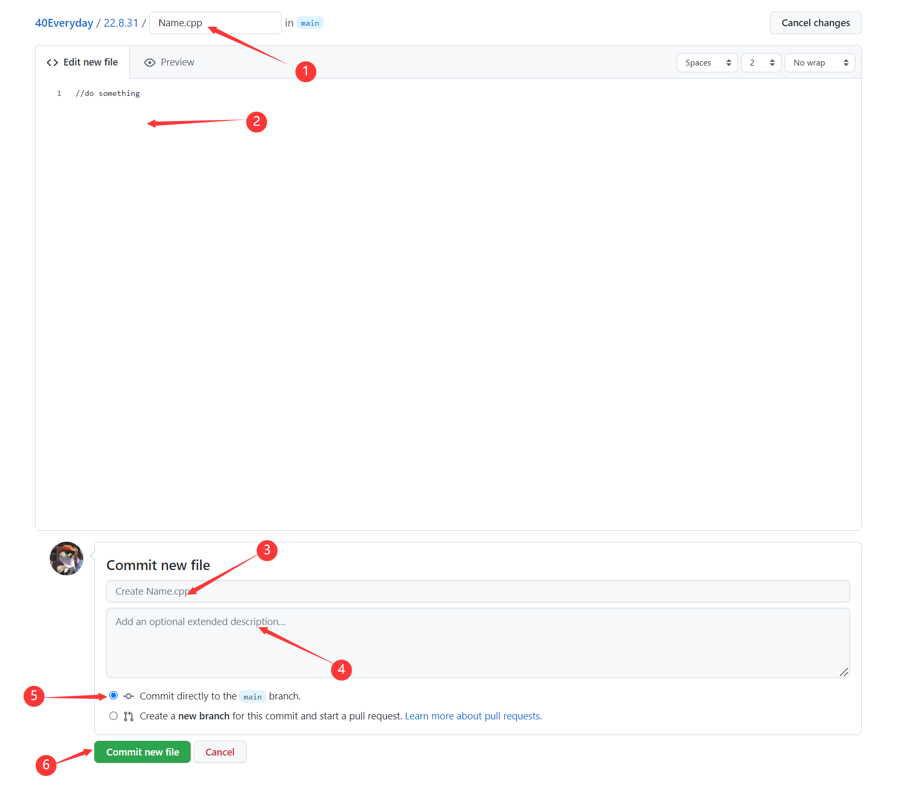

**<u>请先看完说明文档！请先看完说明文档！请先看完说明文档！请先看完说明文档！请先看完说明文档！</u>**

# 40Everyday

#### **40 lines a day keeps the foolish away**

本项目旨在储存每日写的40行代码，互相监督，共同进步。

提供一个代码共享的平台，上传的代码人人可见，查错优化，取长补短。

#### 储存位置：

主文件夹中储存每月的文件夹，命名为**YY.MM**或**YY.M**。月度文件夹下储存日文件夹，命名为**DD**或**D**。例如，**2022年9月1日**的文件应当储存在**40Everyday/22.9/1**文件夹中。每日第一个上传文件的同学负责创建当日文件夹。

#### 上传提示：

1. 进入当天对应的文件夹

2. 点击`Add file` --> `Create new file`

3. 依次执行一下操作，上传文件

   1. 填写文件名
   2. 将代码复制到空白中
   3. 填写对此次上传内容的简要描述(默认为 Create Name.cpp)
   4. 填写对本次上传内容的详细描述
   5. 确保上传到到`main`分支中
   6. 点击commit new file上传文件

   

#### 

#### 注意事项：

1. 任何语言均可，但请**仅上传源代码部分**
2. 每日提交的代码请上传到**对应日期**的文件夹中
3. 请不要在未获允许的情况下修改别人的代码，如果有修改意见/问题请**在issue中发布**

#### 推荐题库：

不知道刷什么题可以参考下面的网站(欢迎安利)：

##### [Leetcode.cn](https://www.leetcode.cn)：

[入门难度](https://leetcode.cn/problemset/all/?difficulty=EASY&page=1)、[数据结构专场](https://leetcode.cn/study-plan/data-structures/) ......

能力强一点的同学可以做做中等/高等难度的题目

**[luogu.org](https://www.luogu.com.cn)**:

[官方题单](https://www.luogu.com.cn/training/list)、官方题单够做一会了......

#### 版权声明：

1.每一个引用/修改/衍生本项目中代码的文件**必须**在该文件中**注明代码出处**，精确到具体文件及文件作者（例：引自/修改/衍生自 40Everyday/22.8.31/BubbleSort.h  *TangentOne*）

2.每一个引用/修改/衍生本项目中的代码文件中必须**维持开源**，并在<u>分发前</u>将代码文件**上传至本项目中**

当满足以上条件时，本项目才可视为开源项目，且遵循GPL开源协议。

GPL的出发点是代码的开源/免费使用和引用/修改/衍生代码的开源/免费使用，但**不允许**修改后和衍生的代码做为**闭源的商业软件发布和销售**。

